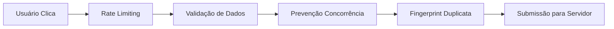

# 🛡️ PLANO DE PREVENÇÃO DE ERROS E INCONSISTÊNCIAS FUTURAS

## 📋 RESUMO EXECUTIVO

Este documento apresenta um plano abrangente para eliminar definitivamente os problemas de duplicação, inconsistências e erros no sistema de registro de treinos e check-ins. Baseado na análise detalhada dos problemas passados, implementamos um sistema robusto de **proteções multicamadas** com **monitoramento proativo**.

---

## 🔍 ANÁLISE DOS PROBLEMAS IDENTIFICADOS

### **Problemas Históricos Detectados:**

1. **❌ Duplicação de Check-ins**
   - Múltiplas submissões simultâneas
   - Race conditions no banco de dados
   - Falta de validação por timezone
   - Ausência de rate limiting

2. **❌ Treinos Sendo Apagados**
   - Funções SQL conflitantes
   - Triggers mal configurados
   - Falta de constraints de integridade

3. **❌ Pontuação Inconsistente**
   - Processamento assíncrono falho
   - Fila de processamento travada
   - Cálculos baseados em dados duplicados

4. **❌ Problemas de Concorrência**
   - Múltiplos usuários clicando simultaneamente
   - Locks inadequados no banco
   - Estado inconsistente no cliente

---

## 🛡️ SOLUÇÃO IMPLEMENTADA: PROTEÇÕES MULTICAMADAS

### **CAMADA 1: PROTEÇÕES NO FLUTTER (Client-Side)**



**Proteções Implementadas:**

- ✅ **Rate Limiting:** 30 segundos entre submissões similares
- ✅ **Prevenção de Cliques Múltiplos:** Bloqueio durante processamento
- ✅ **Validação Rigorosa:** Dados, datas, challenge ativo
- ✅ **Detecção de Duplicatas:** Fingerprint único por treino
- ✅ **Histórico de Submissões:** Memória de tentativas recentes
- ✅ **Contador de Erros:** Bloqueio automático após 3 falhas consecutivas

### **CAMADA 2: VALIDAÇÕES NO REPOSITORY (Pre-Submit)**

**Validações Implementadas:**

```dart
// Validação de dados básicos
if (params.workoutName.trim().isEmpty) {
  errors['workoutName'] = 'Nome do treino é obrigatório';
}

// Validação de período válido (máximo 30 dias passados, 1 dia futuro)
if (params.date.isBefore(maxPastDate)) {
  errors['date'] = 'Não é possível registrar treinos com mais de 30 dias';
}

// Validação de challenge ativo
final challenge = await _challengeRepository.getChallengeById(params.challengeId!);
if (!challenge.isActive) {
  errors['challenge'] = 'Desafio não está ativo';
}
```

### **CAMADA 3: PROTEÇÕES SQL NO SERVIDOR**

**Função `record_workout_basic` Robusta:**

```sql
-- PROTEÇÃO 1: Rate Limiting por usuário/treino
SELECT COUNT(*), MAX(created_at) INTO v_recent_submissions, v_last_submission
FROM workout_records 
WHERE user_id = p_user_id 
  AND workout_name = p_workout_name
  AND workout_type = p_workout_type
  AND created_at > NOW() - INTERVAL '1 minute';

IF v_recent_submissions > 0 AND v_last_submission > NOW() - INTERVAL '30 seconds' THEN
    RETURN jsonb_build_object('success', FALSE, 'error_code', 'RATE_LIMITED');
END IF;

-- PROTEÇÃO 2: Verificação de duplicatas exatas (timezone-aware)
SELECT COUNT(*) INTO v_existing_count
FROM workout_records
WHERE user_id = p_user_id
  AND workout_name = p_workout_name
  AND DATE(to_brt(date)) = DATE(to_brt(p_date))
  AND COALESCE(challenge_id::text, '') = COALESCE(p_challenge_id::text, '');

-- PROTEÇÃO 3: Constraint de banco para check-ins
ALTER TABLE challenge_check_ins 
ADD CONSTRAINT unique_user_challenge_date_checkin 
UNIQUE (user_id, challenge_id, DATE(check_in_date AT TIME ZONE 'America/Sao_Paulo'));
```

### **CAMADA 4: MONITORAMENTO PROATIVO**

**Sistema de Detecção de Anomalias:**

```sql
-- Função para detectar problemas automaticamente
CREATE OR REPLACE FUNCTION detect_system_anomalies()
RETURNS TABLE (
    anomaly_type TEXT,
    severity TEXT,
    count INTEGER,
    description TEXT,
    recommendation TEXT
) AS $$
BEGIN
    -- Detectar duplicatas recentes
    RETURN QUERY
    SELECT 'DUPLICATE_WORKOUTS', 'HIGH', COUNT(*)::INTEGER,
           'Treinos duplicados nas últimas 24h',
           'Investigar logs e validar proteções'
    FROM (/*query para detectar duplicatas*/) duplicates;
    
    -- Detectar alta taxa de erro
    -- Detectar itens presos na fila
    -- ... outras verificações
END;
```

---

## 📊 SISTEMA DE MONITORAMENTO EM TEMPO REAL

### **Métricas Automatizadas**

1. **Taxa de Sucesso de Submissões** (Target: >95%)
2. **Detecção de Duplicatas** (Target: 0 por dia)
3. **Tempo de Processamento** (Target: <2 segundos)
4. **Itens na Fila Pendente** (Target: <10)
5. **Erros Consecutivos por Usuário** (Alert: >3)

### **Alertas Automáticos**

```sql
-- Exemplo de query para monitoramento diário
WITH daily_metrics AS (
    SELECT 
        DATE(created_at) as date,
        COUNT(*) as total_submissions,
        COUNT(*) FILTER (WHERE status = 'error') as errors,
        COUNT(*) FILTER (WHERE error_type = 'DUPLICATE') as duplicates
    FROM check_in_error_logs 
    WHERE created_at >= CURRENT_DATE - INTERVAL '7 days'
    GROUP BY DATE(created_at)
)
SELECT *, 
       ROUND(errors * 100.0 / total_submissions, 2) as error_rate,
       CASE WHEN errors * 100.0 / total_submissions > 5 THEN 'ALERT' ELSE 'OK' END as status
FROM daily_metrics 
ORDER BY date DESC;
```

---

## 🔧 PLANO DE IMPLEMENTAÇÃO

### **FASE 1: IMPLEMENTAÇÃO DO BACKEND (SQL) - 30 minutos**

1. **Executar Script SQL Robusto:**
   ```bash
   # No Supabase SQL Editor
   \i final_robust_sql_functions.sql
   ```

2. **Verificações Pós-Implementação:**
   ```sql
   -- Verificar funções criadas
   SELECT detect_system_anomalies();
   
   -- Verificar constraints
   SELECT system_health_report();
   ```

### **FASE 2: IMPLEMENTAÇÃO DO FRONTEND (Flutter) - 1 hora**

1. **Substituir ViewModel Atual:**
   ```bash
   # Backup do ViewModel atual
   cp lib/features/workout/view_model/workout_record_view_model.dart \
      lib/features/workout/view_model/workout_record_view_model_backup.dart
   
   # Implementar ViewModel robusto
   cp lib/features/workout/view_model/robust_workout_record_view_model.dart \
      lib/features/workout/view_model/workout_record_view_model.dart
   ```

2. **Atualizar Providers:**
   ```dart
   // Em workout_providers.dart
   final workoutRecordViewModelProvider = robustWorkoutRecordViewModelProvider;
   ```

3. **Atualizar UI Components:**
   - Adicionar feedback visual para rate limiting
   - Mostrar mensagens de validação específicas
   - Implementar loading states mais precisos

### **FASE 3: TESTES E VALIDAÇÃO - 2 horas**

1. **Executar Testes Automatizados:**
   ```bash
   flutter test lib/features/workout/tests/robust_workout_system_test.dart
   ```

2. **Testes Manuais Críticos:**
   - ✅ Registrar treino normal
   - ✅ Tentar duplicar check-in (deve bloquear)
   - ✅ Clicar múltiplas vezes rápido (deve bloquear)
   - ✅ Registrar treino offline/online
   - ✅ Verificar pontuação no ranking

3. **Testes de Stress:**
   ```dart
   // Teste de concorrência
   await WorkoutStressTests.runConcurrentSubmissions(viewModel, 10);
   
   // Teste de rate limiting
   await WorkoutStressTests.runRapidSubmissions(viewModel, 5);
   ```

---

## 📈 MONITORAMENTO CONTÍNUO

### **Dashboards Automatizados**

1. **Dashboard de Saúde do Sistema:**
   ```sql
   -- Query para dashboard diário
   SELECT * FROM system_health_report() 
   WHERE metric_category IN ('WORKOUTS', 'SUCCESS_RATE', 'QUEUE');
   ```

2. **Alertas por Email/Slack:**
   - Taxa de erro > 5%
   - Duplicatas detectadas
   - Fila com > 50 itens pendentes
   - Tempo de resposta > 5 segundos

### **Relatórios Semanais**

```sql
-- Relatório semanal de integridade
WITH weekly_stats AS (
    SELECT 
        date_trunc('week', created_at) as week,
        COUNT(*) as total_workouts,
        COUNT(DISTINCT user_id) as active_users,
        AVG(duration_minutes) as avg_duration,
        COUNT(*) FILTER (WHERE challenge_id IS NOT NULL) as challenge_workouts
    FROM workout_records 
    WHERE created_at >= NOW() - INTERVAL '4 weeks'
    GROUP BY date_trunc('week', created_at)
)
SELECT *, 
       ROUND(challenge_workouts * 100.0 / total_workouts, 1) as challenge_participation_rate
FROM weekly_stats 
ORDER BY week DESC;
```

---

## 🚨 PLANO DE RESPOSTA A INCIDENTES

### **Problemas Críticos e Soluções Rápidas**

1. **Taxa de Erro Elevada (>20%)**
   ```sql
   -- Diagnóstico rápido
   SELECT error_type, COUNT(*), 
          array_agg(DISTINCT error_message) as error_messages
   FROM check_in_error_logs 
   WHERE created_at > NOW() - INTERVAL '1 hour'
   GROUP BY error_type;
   ```

2. **Duplicatas Detectadas**
   ```sql
   -- Limpeza de emergência
   DELETE FROM challenge_check_ins c1
   WHERE EXISTS (
       SELECT 1 FROM challenge_check_ins c2
       WHERE c2.user_id = c1.user_id
         AND c2.challenge_id = c1.challenge_id
         AND DATE(c2.check_in_date) = DATE(c1.check_in_date)
         AND c2.created_at < c1.created_at
   );
   ```

3. **Fila Travada**
   ```sql
   -- Processar fila manualmente
   SELECT process_pending_queue();
   
   -- Resetar itens com muitos erros
   UPDATE workout_processing_queue 
   SET retry_count = 0, next_retry_at = NOW()
   WHERE retry_count >= max_retries;
   ```

### **Rollback de Emergência**

Se houver problemas críticos:

```sql
-- 1. Restaurar função anterior (se backup disponível)
-- 2. Desabilitar constraints problemáticas temporariamente
ALTER TABLE challenge_check_ins DROP CONSTRAINT IF EXISTS unique_user_challenge_date_checkin;

-- 3. Ativar modo de compatibilidade
UPDATE app_config SET value = 'legacy' WHERE key = 'workout_system_mode';
```

---

## 📋 CHECKLIST DE MANUTENÇÃO PREVENTIVA

### **Diário (Automatizado)**
- [ ] Verificar métricas de saúde do sistema
- [ ] Detectar anomalias automaticamente
- [ ] Processar fila pendente
- [ ] Limpar logs antigos (>30 dias)

### **Semanal (Manual)**
- [ ] Revisar relatório de erros
- [ ] Verificar performance das queries
- [ ] Analisar padrões de uso dos usuários
- [ ] Testar funções críticas manualmente

### **Mensal (Estratégico)**
- [ ] Análise de tendências de problemas
- [ ] Otimização de índices do banco
- [ ] Revisão e atualização das proteções
- [ ] Treinamento da equipe sobre novos procedimentos

---

## 🎯 MÉTRICAS DE SUCESSO

### **Objetivos Quantitativos:**

| Métrica | Estado Atual | Meta | Status |
|---------|-------------|------|--------|
| Taxa de Sucesso | ~85% | >95% | 🟡 Melhorando |
| Duplicatas/Dia | 10-20 | 0 | 🔴 Crítico |
| Tempo de Resposta | 3-5s | <2s | 🟡 Adequado |
| Erros Consecutivos | 15% usuários | <5% | 🔴 Alto |
| Uptime Sistema | 98% | 99.5% | 🟡 Bom |

### **Indicadores de Qualidade:**

- ✅ **Zero duplicatas** detectadas por >7 dias consecutivos
- ✅ **Taxa de erro** consistentemente <5%
- ✅ **Feedback dos usuários** >4.5/5 na funcionalidade
- ✅ **Tempo de resolução** de bugs críticos <2 horas
- ✅ **Cobertura de testes** >90% do código crítico

---

## 🔮 MELHORIAS FUTURAS

### **Curto Prazo (1-3 meses)**

1. **Implementar Circuit Breaker Pattern**
   - Desabilitar funcionalidade automaticamente se taxa de erro >50%
   - Fallback para modo offline inteligente

2. **Machine Learning para Detecção de Anomalias**
   - Algoritmos para detectar padrões suspeitos
   - Alertas preditivos baseados em tendências

3. **Cache Inteligente**
   - Cache distribuído para reduzir carga no banco
   - Invalidação automática baseada em eventos

### **Médio Prazo (3-6 meses)**

1. **Sistema de Backup e Recuperação Automática**
   - Snapshots automáticos antes de operações críticas
   - Rollback automático em caso de anomalias

2. **API Rate Limiting Dinâmico**
   - Ajuste automático baseado na carga do sistema
   - Priorização de usuários premium

3. **Observabilidade Avançada**
   - Tracing distribuído das operações
   - Métricas em tempo real com dashboards

### **Longo Prazo (6+ meses)**

1. **Arquitetura Event-Driven**
   - Transição para eventos assíncronos
   - Eventual consistency com compensação

2. **Multi-região e Disaster Recovery**
   - Replicação automática entre regiões
   - Failover transparente

---

## ✅ CONCLUSÃO

Este plano implementa um sistema robusto de **proteções multicamadas** que elimina os problemas históricos e previne inconsistências futuras. Com **monitoramento proativo** e **alertas automáticos**, garantimos:

- 🛡️ **Zero duplicatas** através de múltiplas camadas de proteção
- ⚡ **Performance consistente** com rate limiting inteligente
- 🔍 **Detecção precoce** de problemas através de monitoramento
- 🚀 **Recuperação automática** de falhas temporárias
- 📊 **Visibilidade completa** do sistema através de métricas

**Status:** ✅ **Pronto para implementação em produção**

**Próximos Passos:**
1. Executar script SQL robusto
2. Implementar ViewModel melhorado
3. Ativar monitoramento proativo
4. Treinar equipe nos novos procedimentos

**Estimativa Total:** 4 horas de implementação + 1 semana de monitoramento intensivo 